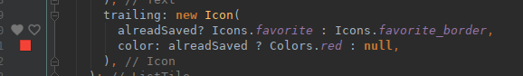

Google recently announced [availability of 1.0 preview
](https://medium.com/flutter-io/flutter-release-preview-1-943a9b6ee65a) of [Flutter](https://flutter.io/), a new
framework for building mobile apps, written from scratch with performance and beautiful UIs in mind. I've always been
interested in building apps for mobile devices in general and Android in particular thanks to the number of Android
devices I own, but was always discouraged by the complexity of building Android apps. I have one on the Android store
that got too unwieldy to work on and I eventually had to cease development due to time constraints. Now with flutter
closing in on its first release build I got interested, not only because it is a new beginning to building mobile apps
-- and we all know that developers love newly built things -- but also because it uses
[Dart](https://www.dartlang.org/), Googles attempt to create a language to replace JavaScript that, sadly, went not far.

But lets get into it. This is as much my first impressions of Flutter as it is of Dart. Here are things I took note of
when working through the [flutter tutorial](https://flutter.io/get-started/codelab/):

* It comes with a formatter! To some that might be rather boring but to me its a big deal. If a language comes with a
  tool that lets me format files out of the box I'm very happy. Well formatted code is easier to read than badly
  formatted code and consistently formatted code is better than inconsistent formatting. A formatter solves both these
  problems.
* Hot reloading of apps makes tweaking UIs a breeze! I remember building Android UIs being excruciatingly slow.
* In Flutter even alignments are widgets and not properties of a widget. Interesting.
* I like Dart so far. It has fat-arrow functions and it's syntax reminds a bit of Ruby and its blocks. I like how it
  lends itself to describing UI structures. I particularly like that it is an OOP language where I can send messages to
  ints or booleans.
* Dart's [package repository](https://pub.dartlang.org/) is nice.
* I love how the IntelliJ plugin shows a little preview of icons and colours in the sidebar: 

I quite enjoyed building the little list generator app from the tutorial. I like how Dart's code is more concise than
plain Java (seriously, the amount of boiler plate code in Android apps always turned me off) and how quickly I was able
to build a decent looking app within an hour or two. Now I really want to build a mobile app, maybe I should revive my
old app using Flutter?
