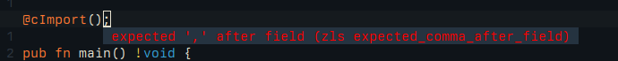

I've been doing some small zig programs to learn the various aspects of the language and its tooling and I figured it might be a good topic to document here.

For my first foray into linking against C libraries I've picked [cimgui](https://github.com/cimgui/cimgui), mostly because I've always wanted to write
something with it. And zig claims to have good C interop, so might as well try that.

This post is a step-by-step documentation of me trying to get this to work, so keep in mind that I haven't really written any C since university and this is
going to be a bumpy ride.

Let's begin by setting up a project:

```
mkdir zig-demo-cimgui && cd zig-demo-cimgui && zig init-exe
```

Now the first challenge is that I need the header file for cimgui. It claims to be a single header so I downloaded it and placed it in my `src` directory:

```
curl -L https://github.com/cimgui/cimgui/raw/docking_inter/cimgui.h -o src/cimgui.h
```

The one thing I remember from C is that you need to include the header files via preprocessor rules and then tell the linker which libraries you want to add.
Zig offers the [`@cImport()` builtin](https://ziglang.org/documentation/0.11.0/#cImport) to parse C and load the available functions and fields into a struct.

```zig
@cImport();
```

The error messages are a little confusing when you're trying to figure out the syntax:



After reading the docs again I realized `@cImport` takes a list of expressions like `@cInclude` or `@cDefine`:

```zig
@cImport({
    @cInclude("cimgui.h");
});
```
I'm still getting the very unhelpful error message `main.zig:5:3: error: expected ',' after field` and I finally realized that I have to assign the return value
of `@cImport` to a const:

```zig
const c = @cImport({
    @cInclude("cimgui.h");
});
```

This finally compiles again so let's try to use the imported library:

```zig
pub fn main() !void {
    _ = c.igCreateContext(null);
}
```
The compiler did _not_ like that:
```
main.zig:3:11: error: C import failed
const c = @cImport({
          ^~~~~~~~
main.zig:3:11: note: libc headers not available; compilation does not link against libc
~/zig-demo-cimgui/zig-cache/o/4f81bba7ec85f00b9a39519067b4c3be/cimport.h:1:10: error: 'cimgui.h' file not found
#
```
Aha, so how does one link libc and how does one specify a search path for finding includes? The docs don't specifically say so but after some poking around
I realize it's all done in `build.zig` with [`linkLibC()`](https://ziglang.org/documentation/master/std/#A;std:Build.LibExeObjStep.linkLibC) and
[`addIncludePath`](https://ziglang.org/documentation/master/std/#A;std:Build.LibExeObjStep.addIncludePath):

```zig
    const exe = b.addExecutable(.{
        // ...
    });

    exe.linkLibC(); // Easy as this
    exe.addIncludePath();
```

[`addIncludePath`](https://ziglang.org/documentation/master/std/#A;std:Build.LibExeObjStep.addIncludePath) took a little bit to figure out. The parameter is of type
[`LazyPath`](https://ziglang.org/documentation/master/std/#A;std:Build.FileSource) but weirdly enough that references a union name `FileSource`. Digging a little
reveals that this is a [deprecated type and things are in motion](https://ziglang.org/documentation/master/std/src/std/Build.zig.html#L60).

Ok, `LazyPath` has several members, we probably want `.path`:

```zig
    exe.addIncludePath(.{ .path = "src" });
```

The literal syntax for structs still feels a bit strange but I'm getting the hang of it. And the good news is the above works, zig finds the header file.
The bad news is the compiler is still not happy:

```
error: too many errors emitted, stopping now
```

Ok, so I remember faintly that cimgui needs a preprocessor define to build all the types. So let's try that, back in main.zig:
```zig
const c = @cImport({
    @cDefine("CIMGUI_DEFINE_ENUMS_AND_STRUCTS", {});
    @cInclude("cimgui.h");
});
```

After the preprocessor and the compiler we're now at the linker and it's also not happy:
```
error: ld.lld: undefined symbol: igCreateContext
    note: referenced by main.zig:9
    note:               ~/zig-demo-cimgui/zig-cache/o/3660e2ee475da70945e7e9e13e998206/zig-demo-cimgui.o:(main.main)
```


