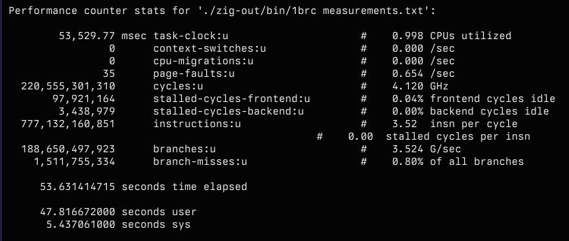
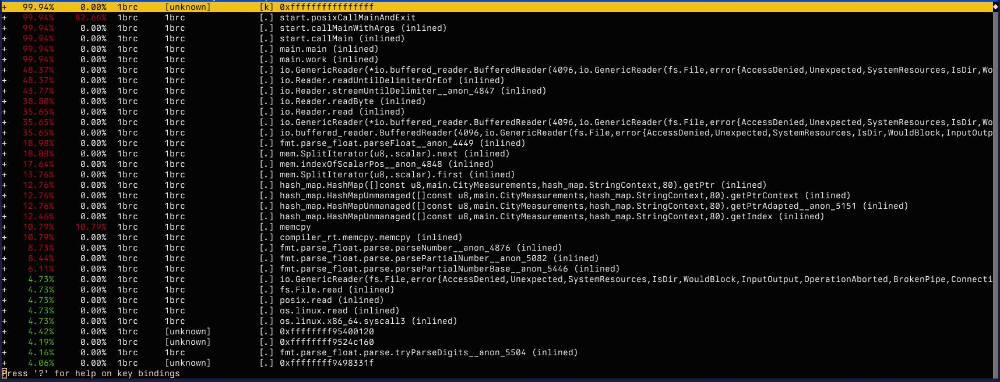

I finally got around to looking into [The One Billion Row Challenge](https://github.com/gunnarmorling/1brc?tab=readme-ov-file). If you're unfamiliar, it's a challenge to how fast a program can read and process one billion rows. It's fascinating because it's all about raw performance including algorithms, CPU instructions, and profiling and benchmarking. All things I enjoy dabbling with.

So one Saturday evening I started reading up on the challenge. The first thing that struck me was the [top entries'](https://www.morling.dev/blog/1brc-results-are-in/) time: 1.535 seconds! For reference, the input is 13 GB. I can't even dump the whole file to `/dev/null` in that short of a time. So clearly, lots to learn.

My first thought was to implement it in Go, but this kind of algorithmic challenge is perfect to learn new languages, and I haven't done enough in [Zig](https://ziglang.org/) recently. The initial, naive implementation didn't go so well. With a reduced subset of 100,000,000 rows without any processing I was already at 4.8 seconds. This led to the next rabbit hole, how does one profile where your program spends your time. I have a lot of experience profiling Go programs with [pprof](https://github.com/google/pprof) but not much with Linux' `perf`. So here I go spelunking in another cavernous rabbit hole.

Initial readings tell me that I'm not sure what to make of this at all. Conceptually I understand ~all~ most of these, but in practice I have no intuition for these numbers.


After some poking around and cursory reading I found the right incantation to get perf to record and unwind the callstacks such that I can make sense of the output:

```
$ perf record -F99 --call-graph dwarf -- ./zig-out/bin/1brc measurements_100000.txt
```

Still not too clear on all the details here, but at least I recognize the symbols:



What's surprising is the amount of time spent parsing floats for example is much lower than I would have expected. What's even more surprising is the amount of time spent in the reader, maybe I'm using it wrong. I double checked the buffer sizes, but they were ok and doubling or tripling them made no difference. And then I spotted the problem: I was using `instream.readUntilDelimiterOrEof` which will read only a single line at best:

```zig
    var instream = buffered_reader.reader();
    var buffer: [8192]u8 = undefined;

    while (try instream.readUntilDelimiterOrEof(buf: &buffer, delimiter: '\n')) |line| {
      // ...
    }
```

I rewrote the function to always read a full buffer of 8KB, and, without any processing, I got reading the entire file down to 2.5 seconds:

```
$ hyperfine './zig-out/bin/1brc measurements.txt'
Benchmark 1: ./zig-out/bin/1brc measurements.txt
  Time (mean ± σ):      2.658 s ±  0.021 s    [User: 0.167 s, System: 2.483 s]
  Range (min … max):    2.640 s …  2.701 s    10 runs
```

My initial reaction was that the slow program is likely executing a lot more reads than it should. I figured the number of syscalls emitted by the program is a good indicator for the number of reads.  I collected the this metric like so:

```
$ perf stat -e raw_syscalls:sys_enter,user_time,system_time -a ./zig-out/bin/1brc measurements.txt
```

The slow program raked up 5.6 million syscalls.

```
 Performance counter stats for 'system wide':

         5,596,331      raw_syscalls:sys_enter
    47,825,420,000 ns   user_time
     2,827,345,000 ns   system_time

      50.702825947 seconds time elapsed
```

The fast one did only 3.5 million syscalls:

```
loading measurements.txt
Read 13795239670 bytes

 Performance counter stats for 'system wide':

         3,497,434      raw_syscalls:sys_enter
       213,073,000 ns   user_time
     2,713,290,000 ns   system_time

       2.930230893 seconds time elapsed
```

Unfortunately the increase in syscalls (5.6 vs 3.5 million) does not quite scale with the program runtime (50 vs 2.5 seconds). My next observation was that the number of executed branches was significantly higher for my first implementation.

```
   188,650,271,726      branches:u                       #    3.640 G/sec
     1,510,203,162      branch-misses:u                  #    0.80% of all branches

      51.841402841 seconds time elapsed
```

That's 189 billion branches executed. Whereas the fast version only executed... 37 million.

```
        37,048,268      branches:u                       #   14.025 M/sec
         3,370,939      branch-misses:u                  #    9.10% of all branches

       2.755307734 seconds time elapsed
```

That'll do it. I don't know yet why `readUntilDelimiterOrEof` is so much slower, but having replaced it my program was already much faster. Took me some time to get it all tied together because Zig is different in several ways. But I got an initial working version and processing the full one billion rows and writing the output clocks in at 1:21. Not too shabby:

```
./zig-out/bin/1brc measurements.txt  56.07s user 25.11s system 99% cpu 1:21.86 total
```

Still a far cry from the winner of the challenge, but already way better than the baseline implementation of 5 minutes. These numbers are not directly comparable because they were produced on different hardware, but at least I'm in the right wheelhouse.

Now the next challenge is to actually profile, analyze, and optimize my implementation. Which leads me to the next challenge: while I conceptually understand SIMD and cache locality, I have not a lot of mechanical intuition in this area. I don't even have much experience in the tools measuring these parameters. For now there's lots to read and learn. It's humbling to see how little I still understand, even after years and years of building software.
