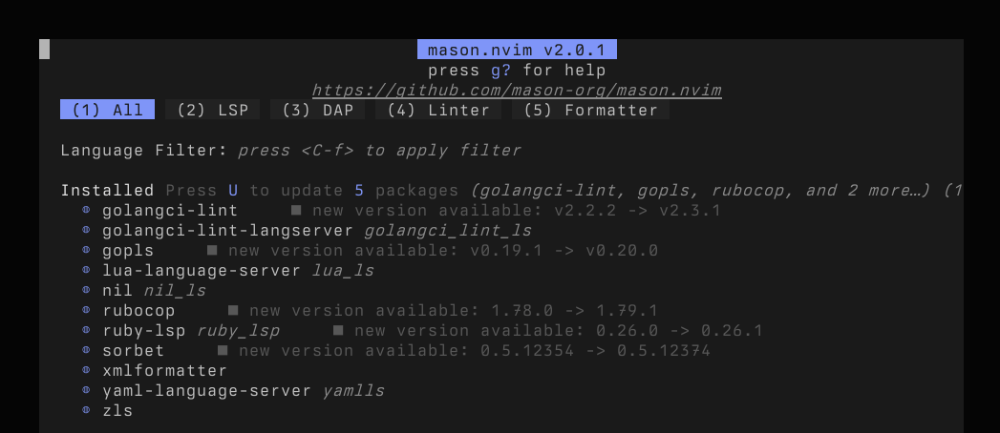

I've been an avid user of vim for years and was happy with it. I spent a good amount of time setting up my vim configuration to my liking and even understood some of it. But then recently I felt compelled to give LLM agents a try and found [avante.nvim](https://github.com/yetone/avante.nvim) highly recommended. Except it's a Neovim plugin. So far I've been pretty indifferent towards Neovim but this was enough of a motivator to give it a try. Hubris and how-hard-can-it-be thinking got the better of me and I set out to create a blank `init.lua`. I learned a lot about how Neovim works. This post is a collection of fundamentals that are obvious in hindsight but irritating and surprising to figure out as a beginner. 

## Neovim and lua

Neovim offers a lua api to configure and script and it's powerful and flexible, but it was confusing initially. The realization that `init.lua` is interpreted at startup made a lot of things click. Neovim starts, executes the Lua script, and then it's ready for you.  

This means that you're just writing lua code that runs in your editor and you can use the APIs it offers to configure your editor, install plugins, script utilities, set up key bindings, and much more. On the flip side, if you leave your `init.lua` empty, Neovim starts with the [default settings](https://neovim.io/doc/user/vim_diff.html#_defaults).

In your `init.lua` you'll want to do a few things:

- change Neovim's settings around a bit. Things like show line numbers, tab stop, etc. These settings come from vim and vim global settings are exposed as `vim.opt.<name>`. For example, you want Neovim to expand tabs to spaces, you'd set `vim.opt.expandtab = true`. You can learn more about this with `:help vim.opt`.
- run some vim commands, e.g. change your colorscheme. It's curious that this is a command and not a setting, but that's the mystery of vim for you. In any case, vim commands are exposed via `vim.cmd.<command>`. The biggest difference that these are (I believe) actual lua functions, so you don't assign, you call them with a parameter, like so: `vim.cmd.colorscheme 'ayu'` 
- set global variables, which in vim used to be something like let `g:MyVariable="Value"`. In neovim, that's `vim.g.<name> = value`. This is mostly used by plugins.

Aside from that, you can include other lua scripts via `require`, which is heavily used by plugin managers. But you could also easily split your configuration into multiple files and require them to keep things neat. [Neovim's lua guide](https://neovim.io/doc/user/lua-guide.html) has a good summary of these concepts and some useful tips.


A starter `init.lua` could look like this:
```lua 
# ~/.config/nvim/init.lua
vim.cmd.colorscheme 'evening'
vim.opt.number = true      -- show line numbers
vim.opt.scrolloff = 5      -- don't let the cursor hit top/bottom of the screen
vim.opt.cursorline = true  -- show a line to show where the cursor is
```

Place this in `~/.config/nvim/init.lua`, restart your editor, and behold your changes. If you want to learn more about Neovim's startup procedure, check [`:help initialization`](https://neovim.io/doc/user/starting.html#_initialization).

## Neovim and plugins

Neovim has tons of nice things built in, but let's face it, you'll probably want all the shiny toys; nice code completion for example. Maybe some auto formatting, etc. Installing plugins is usually done by plugin managers, and for no other reason than avante recommending it, I went with [lazy.nvim](https://github.com/folke/lazy.nvim).

Fundamentally, plugin managers are just more lua code that gets executed by Neovim, and as such, their configuration is just more lua. To install lazy.nvim, you follow their instructions. The gist is to create `~/.config/nvim/lua/config/lazy.lua` with enough code to bootstrap the plugin manager lua code itself. Neovim will automatically load Lua files in `~/config/nvim/lua/*/*/*.lua`. Once the plugin manager is installed and you've restarted Neovim, you should be able to launch the plugin manager via `:Lazy`. Find the detailed steps in the [installation section](https://lazy.folke.io/installation) in lazy's manual.

Installing plugins is done via files in `~/.config/nvim/lua/plugins/<name>.lua`. These files return a Lua table that contains the URL (or path) to load the plugin from, and some settings:

```lua 
-- ~/.config/nvim/lua/plugins/vim-surround.lua
return { 
	"tpope/vim-surround", 
	event = { "BufReadPost", "BufNewFile" },
}
```

The table returned by this file can contain many other elements, as documented in https://lazy.folke.io/spec . I found the spec a bit hard to parse, but after writing a few of these, I understand how it's composed. The properties described in each section can all show up in the table and be used to configure how and when to load the plugin, configure it, set keybindings, and other things.

As example that uses some more features, here's how I use fzf with the following settings to set it up with its keybindings:

```lua 
-- ~/.config/nvim/lua/plugins/fzf.lua
return {
    "junegunn/fzf.vim",
    build = "./install --all",
    lazy = false,
    init = function()
        vim.keymap.set('n', 'ff', '<cmd>Files<cr>')
        vim.keymap.set('n', 'ft', '<cmd>Tags<cr>')
        vim.keymap.set('n', 'fT', '<cmd>BTags<cr>')
        vim.keymap.set('n', 'fb', '<cmd>Buffers<cr>')
        vim.keymap.set('n', 'fc', '<cmd>Rg<cr>')
        vim.keymap.set('n', 'fl', '<cmd>BLines<cr>')
        vim.keymap.set('n', 'fh', '<cmd>History<cr>')
        vim.keymap.set('n', 'fw', '<cmd>Windows<cr>')
    end,
    dependencies = {
        "junegunn/fzf",
    }
}
```

Now you're ready to install plugins!

## Neovim and LSP

Before we get to completion we'll have to talk about LSP. Even though Neovim has builtin completion via omnifunc, you'll probably want to use a language server to get language specific completions. The good news is that Neovim has a builtin LSP client. The bad news is that you'll have to configure it. One way of going about it is to set up according to the [LSP quickstart](https://neovim.io/doc/user/lsp.html#_quickstart) docs by manually setting up a LSP config or using [nvim-lspconfig](https://github.com/neovim/nvim-lspconfig).

Manually you can configure a LSP by adding this to your `init.lua`:

```lua 
# ~/.config/nvim/init.lua
vim.lsp.config['gopls'] = {
  -- Command and arguments to start the server.
  cmd = { 'gopls' },
  -- Filetypes to automatically attach to.
  filetypes = { 'go' },
  -- Sets the "workspace" to the directory where any of these files is found.
  -- Files that share a root directory will reuse the LSP server connection.
  -- Nested lists indicate equal priority, see |vim.lsp.Config|.
  root_markers = { { 'go.mod', 'go.sum' }, '.git' },
}
```

This works, but you have to ensure that the your lsp binary is installed and available. This is where [`mason.nvim`](https://github.com/mason-org/mason.nvim) comes in. This plugin installs language servers, formatters, etc for you. Set up mason as a plugin, and add the following line to your `init.lua`:

```lua 
# ~/.config/nvim/init.lua
require("mason").setup()
```

Once installed, you can open Mason with the `:Mason` command. From here you can install/update/etc lots of goodies.




But we can do even better. The [`mason-lspconfig`](https://github.com/mason-org/mason-lspconfig.nvim) plugin will automatically configure and enable installed LSP servers for you. 
## Neovim and Completion 

## Treesitter 

